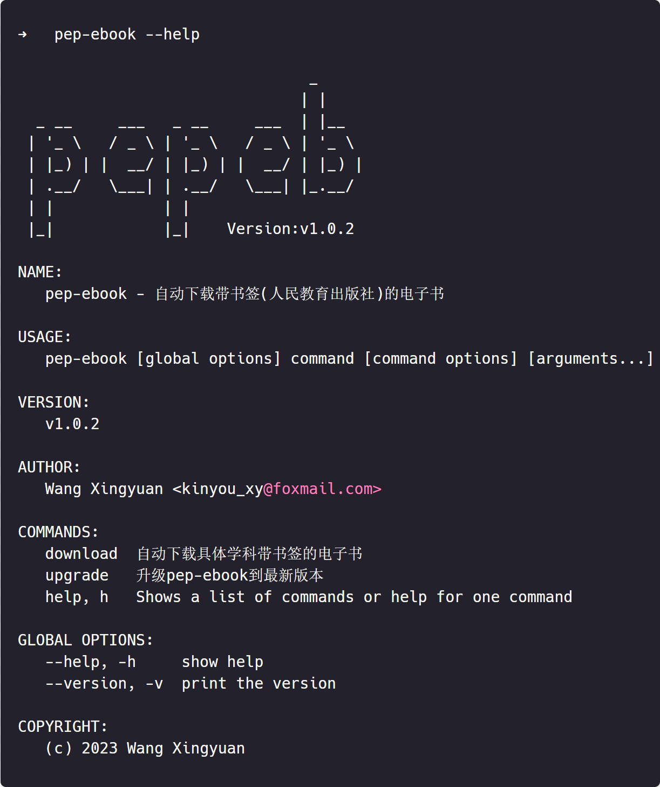
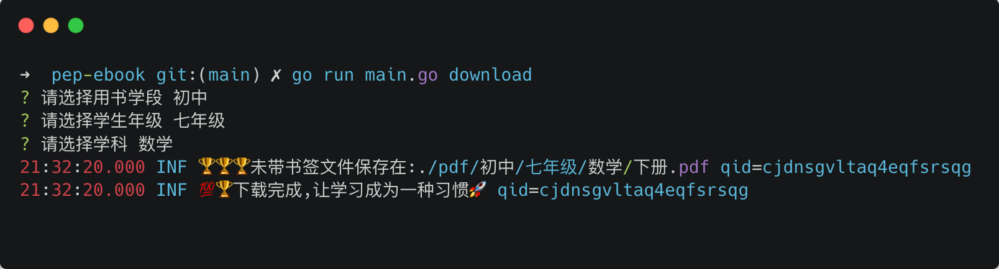

# pep-ebook — 自动下载带书签(人民教育出版社)的电子书.





### 为什么写这个项目
  
  - 如果你的孩子正在上初中,那么你就不可避免给孩子辅导作业,但是你每天辛苦工作根本没有时间拿着孩子的教材先看一遍老师今天讲的课本内容,所有只能抽取零碎
的时间(例如上厕所,坐公交)去看对应的教材,我本来在网上已经找到了对应的对应教材的pdf文件,但是所有的pdf文件都没有书签,导致每次找东西都要把pdf文件从 
  头翻一遍,所以就有了这个项目
  - 如果你或者你的孩子不是自媒体短视频的从业者,那么建议你或者你的孩子远离短视频软件,它的危害真的很大

### 安装

你可以使用下面的命令进行安装:

```bash
go install github.com/maogou/pep-ebook@latest
```

> 提示: 如果go install成功，却提示找不到pepeb命令，这是因为环境变量没有配置，可以把 GOBIN 目录配置到环境变量中即可

### 查看帮助

你可以使用下面的命令查看帮助:

```bash
pep-ebook --help
```

### 如下命令可供你使用

你可以使用download下载,使用upgrade进行命令升级:

```bash
pep-ebook download 
pep-ebook upgrade
```

### TODO LIST

 - [x] 初中-七年级-数学上册 书签已更新完成可下载
 - [x] 初中-七年级-数学下册 书签已更新完成可下载
 - [x] 初中-八年级-数学上册 书签已更新完成可下载
 - [x] 初中-八年级-数学下册 书签已更新完成可下载
 - [x] 初中-九年级-数学上册 书签已更新完成可下载

 - [ ] 并发请求用户选择选课url,加快生成pdf文件
 - [ ] 书签的自动更新算法
 - [ ] 各学科的访问url自动更新维护
 - [ ] 重复下载文件的检测
 - [ ] 各学科的书签待提交


### 二次开发调试

如果你想调试此项目(使用了责任链设计模式),或者查看项目的命令的执行日志,那么你需要这样做:

```yaml
# 在命令所在目录新建  config
# 并且创建一个配置文件 pep-ebook.yaml
# 然后写入如下内容,可以查看到命令打印的日志
# 默认情况日志是关闭的,只会打印一些必须的提示信息
debug: true
```


## 贡献

如果您发现任何问题或有任何改进意见，请随时提出问题或提交拉取请求。我非常欢迎您的贡献！

## 许可证

pep-ebook是根据MIT许可证发布的。有关更多信息，请参见[LICENSE](LICENSE.md)文件

## 免责申明

本代码仅用于学习，下载后请勿用于商业用途,如果对出版社造成任何影响和本人无关!


